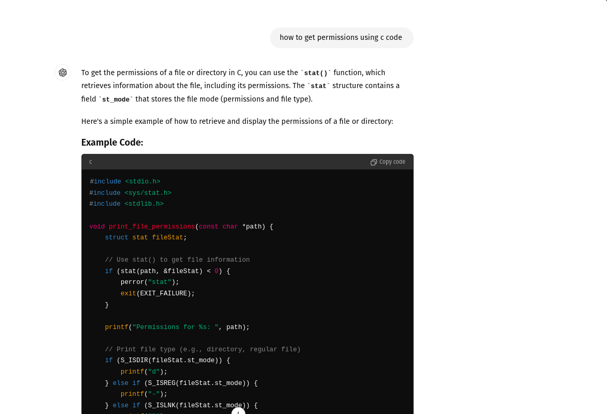
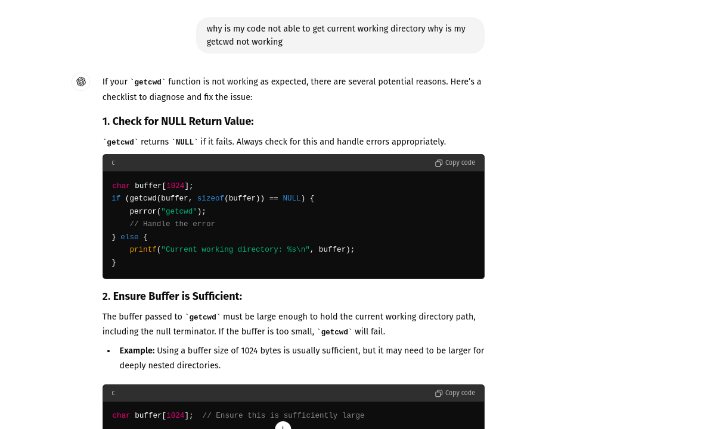
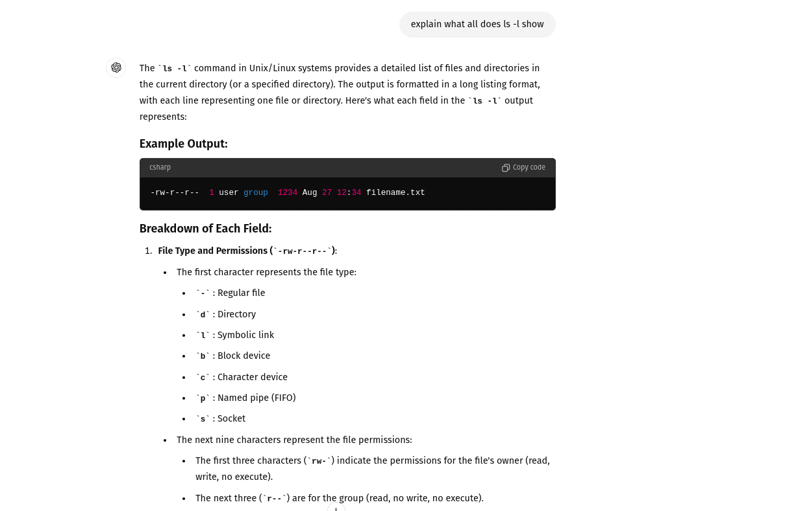
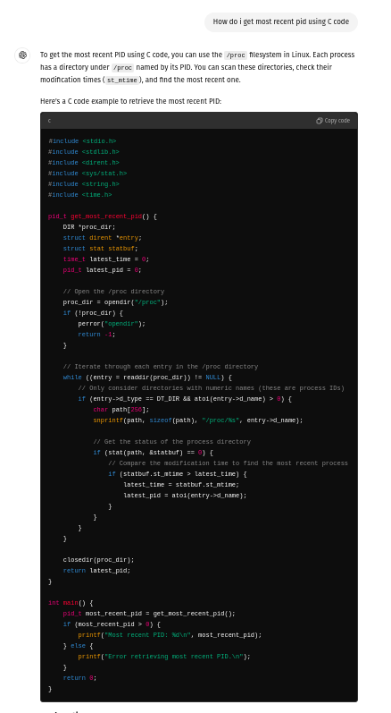

# mini-project-1-template
# myshell

## Spec1
- The directory in which shell is invoked becomes the home directory for the shell and is represented with “~”. All paths inside this directory are shown relative to it. Absolute path of a directory/file are shown when outside the home directory.
## Spec2
- I have use strtok to tokenize 
- I have assumed max length of command to be 4096
- I have assumed  command has atmost 100 words separated by spaces

## Spec 3
- hop supports “.”, “..”, “~”, and “-” symbols.
- I have also considered relative paths with respect to prev directory 
  - paths like -/../..
## Spec 4
- reveal supports “.”, “..”, “~”, and “-” symbols.

- I have assumed a document can have atmost 1000 files and directories (including hidden files).
- I have assumed that there wont be any space between "-" and flags
- If flag is given in the form  given below i have considered valid flags and ignored all other flags
   - reveal -lahh
  - for the above command i have considered only l and a and ignore h
- i have sorted in lexographical order (CASE sensitive)

## Spec 5
- Erroneous commands are also stored in log 
- Commands executed using log execute are not stored in log
## Spec 6
- Whenever the background process finishes, a message is displayed to the user. However, sometimes the message can be printed while the shell is waiting for a command, which can disrupt the command being entered.
- If time taken for command is > 2 then i am printing the whole command in the next prompt.

## Spec 7
- I have reffered stack exchange to get information of the process 
https://stackoverflow.com/questions/39066998/what-are-the-meaning-of-values-at-proc-pid-stat

- units of virtual memory is bytes
## Spec 8
- i have assumed total number of matching directories/files  are less than 1000
- i have assumed max depth of any file from target directory to be 20
## Spec 9 
- my .myshrc should have aliases defined in this form aliase=originalcommand not aliase='originalcommand'
- i have assumed .myshrc has at max 10 aliases defined
- i have assumed my aliase can have at max 1000 characters
- i have assumed .myshrc has no comments 
## Spec 10,11,12
- i have not handled cases with multiple input and output 
- if a command with pipe has an & then the and must be at end
- i have assumed there can at max be 99 pipes
## Spec 13
- i have sorted in lexographical order of pids
- i have assumed total number of activities will be lesser than 100
- i have assumed pids of all the processes will be lesser than int32max
- 
## Spec 14
- ctrl z and ctrl c do not print anything if no foreground process is running
## Spec 15
- both fg and bg are implemented using signals
## Spec 16
-  I am retrieving the most recent PID by reading the /proc filesystem and comparing the start times of different processes
- pressing x will immediately terminate the program
## Spec 17
- i have assumed max size of the responsse received will be lesser than 10000
- man page not found error is not handled separately
- if there are more than one arguments then only first argument is considered

## INSTRUCTIONS

    exit can be used for terminating the program
## chat gpt refferences 
  - 

- 

- 

https://chatgpt.com/c/66dafe9a-5260-8005-833d-bbbc6a9d01b3

 # How to run
 -  run make
 -  run ./myprogram
 

